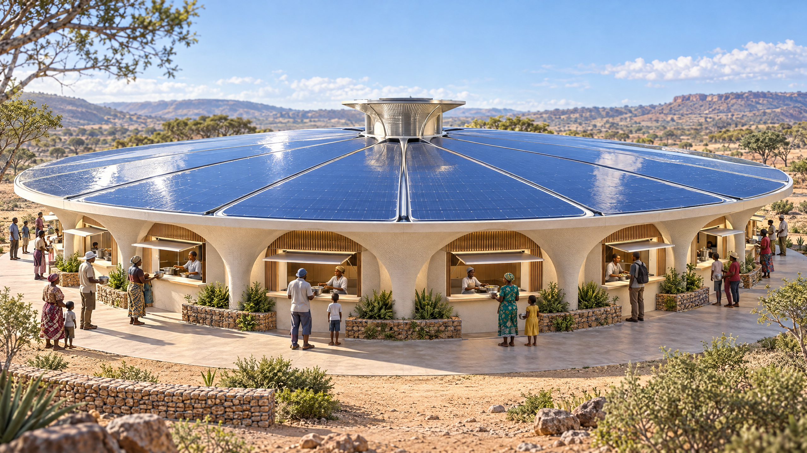
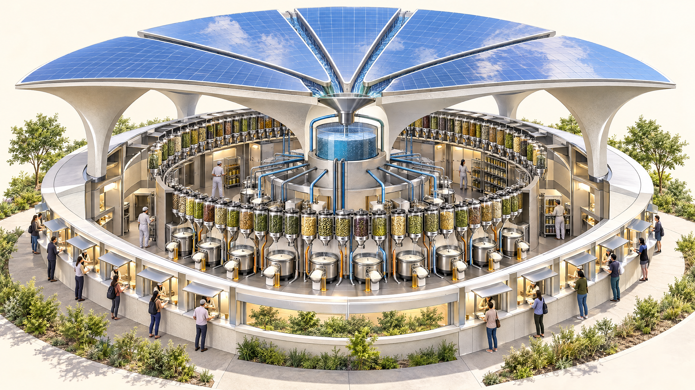
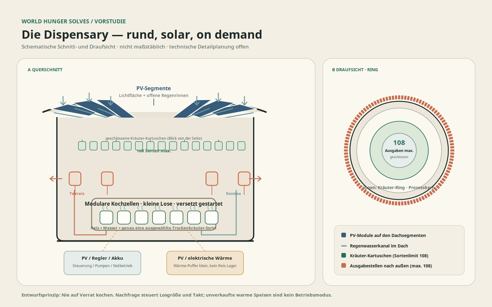
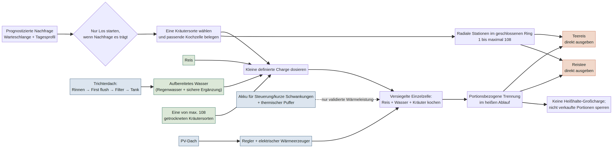

# TeeReis/ReisTee-Dispensary

## Technisches Konzeptpapier und Vorstudie

**WorldHungerSolves · Arbeitsstand: 3. Oktober 2026**

**Status:** konzeptionelle Vorstudie, keine Bau-, Lebensmittel- oder Anlagenfreigabe

> Ein rundes Haus, das Sonne und Regen in eine gemeinsame Kochenergie- und Wasserquelle übersetzt: Reis, Wasser und eine ausgewählte getrocknete Kräutersorte werden frisch gegart. Am selben Kochzyklus entstehen Teereis und Reistee. Ausgegeben wird nur, wofür eine aktuelle Nachfrage besteht.

Die Dispensary bleibt ein großes rundes Gebäude mit UFO-/Raumschiff-Anmutung. Ein trichterförmiges Dach bildet zugleich die große Solarfläche und den Regenfänger. Rund um den Bau liegen nach außen gerichtete Ausgabestellen. Ein ringförmiges Sortiment aus maximal 108 Kräutersorten setzt die obere Grenze für maximal 108 Ausgabestellen. Das ist eine Konzeptvorgabe, kein technischer Nachweis, dass alle 108 Positionen gleichzeitig sinnvoll oder hygienisch betreibbar sind.

### Visuelles Konzept

Die folgenden Bilder sind Architekturstudien zur Kommunikation der Idee, keine Ausführungs- oder Sicherheitszeichnungen. Die präzise beschriftete Schemazeichnung und der Prozessablauf zeigen den vorgesehenen technischen Aufbau als Vorentwurf.

Die editierbaren Dateien dazu liegen unter `visuals/architecture.svg`, `visuals/process-flow.mmd` und `visuals/draw_schematic.py`.

## 1. Was die Referenzen belegen – und was nicht

### Solarwärme und Wärmepuffer

Großküchen mit Scheffler-Reflektoren zeigen, dass konzentrierte Sonnenwärme, Dampferzeugung und isolierte Leitungen institutionelles Kochen in großem Maßstab unterstützen können. Eine Feldstudie beschreibt eine seit 2001 betriebene Anlage mit 28 Reflektoren zu je 10 m², einem Speicher-/Dampftank und Dampfverteilung bis zur Küche; der Betreiber gab eine Kapazität von 6.000 Mahlzeiten pro Tag und etwa 200 wetterabhängige Betriebstage pro Jahr an. Das ist ein Beleg für solare Gemeinschaftsküchen, aber weder für Reis-Durchsatz noch für den hier vorgeschlagenen Ringautomaten. [1]

Das Scheffler-Netzwerk nennt für einen 8-m²-Reflektor bei direkter Einstrahlung von 700 W/m² eine mittlere Kochleistung von 2,2 kW und bis zu 57 % Wirkungsgrad für das Erwärmen von Wasser. Diese Werte sind Entwicklerangaben unter ausgewählten Bedingungen, keine garantierte Standortleistung. Temperaturangaben am Brennpunkt dürfen nicht mit der Temperatur von Dampf, Speicher oder Reis verwechselt werden. [2]

Ein kleinerer Solar-Speicher-Versuch zielte rechnerisch auf 1 kg Reis in 45 Minuten, erreichte im dokumentierten Versuch mit Wasser jedoch nur rund 82 °C nach 40 Minuten. Er zeigt, warum vollständiges Garen, reale Verluste und Speicherentladung an einem Prototyp gemessen werden müssen, statt eine Großküchenleistung aus einem Modellwert hochzurechnen. [4] Eine Machbarkeitsstudie zu Solar-Dampfgaren für 500 Studierende ist ein weiterer Auslegungsfall, aber keine unabhängige Betriebsdemonstration dieser Dispensary. [3]

**Folgerung:** Für den Vorentwurf ist elektrische Wärmeerzeugung über PV die steuerbare Referenz für kleine Kochzellen. Ein thermischer Speicher oder eine Dampfschiene kann später getestet werden. Ein Akku sollte zunächst Steuerung, Pumpen, Sensorik und kurze Leistungsschwankungen puffern; einen stundenlangen elektrischen Kochbetrieb aus Batterien anzunehmen wäre ohne Lastprofil und Speicherkosten nicht begründet. Die Wärmereserve muss separat ausgelegt und thermisch sowie drucktechnisch abgesichert werden.

### Automatisiertes Reiskochen

Ein kommerzieller Chargenkocher wird mit rund 8,2 kg trockenem Reis je Vollcharge, etwa 46 Minuten Kochzeit, 3,33 kW Anschlussleistung und 230 V/15 A spezifiziert. Der Hersteller nennt bis zu etwa 19,1 kg gegarten Reis je Charge. Das sind Produktdaten, keine unabhängige Abnahme und keine Tagesleistung. Ein kontinuierlicher Forschungs-Pilot nennt 12 kg Rohreis pro Stunde. Industrieangebote reichen deutlich höher, benötigen jedoch viel Wasser und Dampf und sind nicht für eine kleine, schwankende Ausgabestelle belegt. [5–7]

Diese Größenordnung zeigt zwei Dinge: Reiskochen im Großmaßstab ist keine unbekannte Geräteklasse. Die entscheidende Entwicklungsarbeit liegt hier aber bei kleinen, separat abschaltbaren Kochzellen, reproduzierbarer Kräuterdosierung, der gleichzeitigen Aufteilung des Kochwassers und hygienisch zugänglichen Produktwegen. Eine 8-kg-Charge kann nicht als Muster für 8 kg „on demand“ ausgegebenen Reis dienen, wenn die Nachfrage viel kleiner ist.

### Dach, Regenwasser und Lebensmittelwasser

Die Grundbilanz für Regenwasser lautet:

`nutzbares Volumen (L) ≈ Dachfläche (m²) × Niederschlag (mm) × Abflussbeiwert × 1 L/(m²·mm) − First-Flush-/Verluste`

Ein US-Energiebehörden-Leitfaden nennt als typische Systemeffizienz 0,75–0,90, abhängig unter anderem von Dachmaterial, First Flush, Verdunstung, Überlauf und Leckage. Er empfiehlt, Dachfläche, örtliche Niederschläge und den zeitlichen Bedarf gemeinsam auszulegen. Für Trinkwasser- bzw. Kochwasseranwendungen verlangt er zusätzliche Filtration und Desinfektion samt laufender Wasserqualitätskontrolle und qualifiziertem Betrieb. Diese Quelle liefert eine Auslegungsmethode, keine Freigabe für einen bestimmten Standort. [8]

Eine 2025 veröffentlichte Studie schätzt die kombinierte PV-/Regenwasserernte für den Sahel modellbasiert und zeigt starke regionale sowie saisonale Unterschiede. Sie verwendet unter anderem einen angenommenen Abflusskoeffizienten von 0,90 und First-Flush-Abzüge. Die Autoren weisen zugleich darauf hin, dass Messwerte zu PV-Oberflächenverlusten noch begrenzt sind. Der Ertrag darf daher nicht ohne lokalen Niederschlag und Dachdetails übertragen werden. [9]

Regenwasser ist nicht automatisch Trinkwasser: Staub, Vogelkot sowie Dach-, Rinnen-, Rohr- und Tankmaterial können Keime oder Chemikalien eintragen. CDC empfiehlt einen First-Flush-Ableiter, passende Behandlung und regelmäßige Tests, wenn das Wasser zum Kochen oder Trinken genutzt wird. Eine südafrikanische Dachwasserstudie fand für die untersuchten Proben teilweise unzureichende mikrobielle Indikatoren und empfiehlt, den ersten Abfluss zu verwerfen und die Qualität am Ort zu behandeln. [10, 11]

**Folgerung:** Das Dach hat PV-Felder und konstruktiv getrennte, zugängliche Regenrinnen; Wasser darf nicht über ungeeignete PV-Rahmen oder unbekannte Beschichtungen geführt werden. Jede Rinne speist Sieb/Laubfang und First Flush, dann einen geschlossenen Tank mit Überlauf, Messung und Entnahme. Kochwasser geht erst nach standortgerechter Aufbereitung und Freigabe in den Prozess. Wird die nötige Qualität nicht erreicht oder ist der Tank leer, wird sicheres Wasser aus einer geprüften externen Quelle innerhalb derselben Input-Kategorie **Wasser** verwendet. Regenwasser ist Teilquelle, keine Behauptung völliger Autarkie.

### Lebensmittelsicherheit von Reis und trockenen Kräutern

Bei Reis können Sporen von *Bacillus cereus* die übliche Kochhitze überstehen. Bei ungünstiger Zeit-Temperatur-Führung können sie keimen; bereits gebildetes Cereulid ist hitzestabil und wird durch normales Wiedererhitzen nicht zuverlässig unschädlich. Das BfR nennt für das Wachstum typischerweise etwa 10–50 °C, ein Optimum um 30–40 °C und weist auf einzelne kälteverträgliche Stämme hin. [12]

Behördenwerte haben unterschiedliche Rechtsräume und Zwecke. BfR nennt als Kontrollbeispiele rasche Kühlung auf höchstens 7 °C oder Heißhaltung bei mindestens 60 °C; LAVES empfiehlt kleine Portionen und bei Kühlung weniger als 10 °C innerhalb von zwei Stunden. Der US-FDA Food Code enthält für seinen Anwendungsbereich eine Kühlkurve von 57 auf 21 °C innerhalb von zwei Stunden und auf höchstens 5 °C innerhalb von insgesamt sechs Stunden sowie Heißhaltung ab 57 °C. Das sind nicht austauschbare weltweite Grenzwerte. EU-Hygienerecht fordert HACCP-basierte Kontrollen und rasches Abkühlen, nennt aber keine feste Reis-spezifische Zahl. Der Einsatzort muss vor Inbetriebnahme mit der zuständigen Lebensmittelüberwachung und dem lokalen Recht abgeglichen werden. [12–15]

Die Dispensary setzt deshalb auf **frisch garen und sofort ausgeben**, nicht auf Vorratskochen. Ein Kochzyklus wird nicht gestartet, um einen großen Warmhaltevorrat aufzubauen. Jede Zelle erhält eine eindeutige Startzeit; Sensoren prüfen einen im HACCP-Plan validierten Garprozess. Fertige Portionen gehen unmittelbar an die Ausgabe. Bei unbekannter Zeit-/Temperaturhistorie wird die Charge gesperrt und nach Regelwerk verworfen; Wiedererhitzen ist keine pauschale Korrekturmaßnahme.

Getrocknet bedeutet nicht steril oder automatisch sicher. Codex nennt für Kräuter und Gewürze unter anderem pathogene Keime, Sporenbildner, Schimmel/Mykotoxine und Kontaminanten als relevante Gefahren. Ein Sortiment von 108 Sorten braucht je Zutat eine Lieferantenfreigabe, botanische Identität, Pflanzenteil, Herkunft, Chargen-ID und Prüfung des Lebensmittelstatus. Das EFSA-Botanicals-Compendium ist eine Gefahrenidentifikationshilfe, keine Sicherheitsfreigabe; neuartige Lebensmittel sind je Art und Verwendungsform gesondert zu prüfen. [17–19]

**Lagerentwurf:** 108 ist die Sortimentsobergrenze, nicht die Pflicht, alle Positionen am ersten Tag zu befüllen. Getrennte geschlossene Kassetten schützen vor Feuchte, Licht, Schädlingszutritt und Verschleppung. Dosierer werden je Sorte auf Masse und Fließverhalten kalibriert. Kontaktmaterialien müssen für Lebensmittelkontakt geeignet sein; Produktpfade müssen zugänglich und reinigbar sein. Allergene und Kreuzkontakt werden in Beschaffung, Kassettenwechsel und Ausgabe berücksichtigt. Keine gemeinsame offene Schütte und kein unvalidiertes „Aroma-Hopper“-System. Für EU-Betrieb gelten unter anderem Lebensmittelkontakt-, Rückverfolgbarkeits- und Allergenkennzeichnungsregeln. [20–22]

### Ringausgabe und Architektur

Kommerzielle Sushi-Förderer belegen, dass kurvige und modular konfigurierbare Förderabschnitte im Gastronomieumfeld existieren. Ein Verkaufsautomatenpatent dokumentiert ein entnehmbares, indexiertes Karussell. Es gibt jedoch keine hier gefundene validierte Gemeinschaftsküche mit 108 unabhängigen radialen Koch- und Ausgabeplätzen. Die Übertragung ist ein Konstruktionsvorschlag, kein Marktbeleg. [23, 24]

Bei 108 gleichmäßig verteilten Positionen beträgt der Winkel rechnerisch `360° / 108 = 3,33°` je Position. Der tatsächliche Umfang pro Stelle hängt vom Radius ab: `Abstand = π × Durchmesser / 108`. Das Limit bleibt strikt bei maximal 108. Eine Pilotanlage kann weniger Stellen an einem geschlossenen Ring testen und später modular erweitern, ohne das 108er-Limit aufzuweichen.

Lebensmittelautomaten müssen so gestaltet sein, dass Kontamination vermieden wird und Kontaktflächen, soweit praktikabel, gereinigt und desinfiziert werden können. Produktwege und Dosierer sollten daher einzeln entnehmbar sein. Wartung und Nachfüllung erfolgen von einer rückwärtigen Serviceseite, nicht durch den Kundenring. Publikumswarteschlange, Barrierefreiheit, Fluchtwege und Brandschutz sind standortbezogen mit Bauaufsicht und Fachplanung festzulegen; eine 108er-Ausgabe darf keinen Rettungsweg ersetzen oder verengen. [14, 26, 27]

## 2. Technischer Vorentwurf

### Gebäude und Funktionszonen

1. **Außenring:** kreisförmige, wettergeschützte Wand mit höchstens 108 Ausgabestellen nach außen. Im Pilot werden nur die Zahl der tatsächlich getesteten Plätze und Kräutersorten gebaut. Ausgaben erhalten getrennte, hygienisch reinigbare Flächen für Teereis und Reistee, sofern beide nicht als Einheit ausgegeben werden.
2. **Innenring Kräuter:** bis zu 108 geschlossene, beschriftete Vorrats- und Dosiereinheiten. Jede Kassette ist unabhängig sperrbar, herausnehmbar und chargenrückverfolgbar. Die technische Aufteilung wird nicht als „alle 108 gleichzeitig sicher“ angenommen.
3. **Prozesskern:** mehrere kleine Kochzellen statt eines großen gemeinsamen Kessels. Jede Zelle dosiert Reis, aufbereitetes Wasser und eine ausgewählte Kräutersorte. Kochwasser und Reis werden am Ende eines Zyklus in einem validierten Schritt getrennt beziehungsweise portioniert.
4. **Energie-/Wasserzone:** kontrollierte PV- und Steuerungstechnik, Pumpen, Wärmespeicher, Wasseraufbereitung und Tanküberwachung. Elektrische Komponenten sind räumlich von nassen Reinigungs- und Wasserwegen getrennt.
5. **Servicering:** geschützter innerer Gang für Reinigung, Nachfüllen, Wartung und Entnahme gesperrter Chargen. Er muss unabhängig vom Publikumsbereich zugänglich sein und darf keinen Notausgang blockieren.

Die Bilder im visuellen Konzept stellen dieses Zonenprinzip dar. Abmessungen, tragende Struktur, Wind-/Schneelasten, Solarstatik, Brandschutz, Druckbehälter, Entwässerung und örtliche Bauvorschriften sind noch nicht berechnet.

### Ein Kochzyklus

1. **Bedarf feststellen:** Die Prognose ermittelt, welche Sorte und wie viele Portionen in einem kurzen Zeitfenster tatsächlich angefragt sind. Das System startet nur, wenn die berechnete Losgröße mit einer validierten Kochzelle und dem erwarteten Abfluss zusammenpasst.
2. **Rohstoffe zuordnen:** Für den Zyklus werden Reischarge, Wassercharge und eine der zugelassenen Kräutersorten geloggt. Andere Zutaten sind ausgeschlossen.
3. **Kleine Charge dosieren:** Die Zelle wiegt Reis und eine produktspezifische Kräutermenge ab. Wasser wird nach Rezeptur und gewünschter gleichzeitiger Ausbeute abgemessen. Mengen sind Entwicklungsparameter, keine bereits festgelegten Portionsstandards.
4. **Kochen:** Die Zelle startet nur bei verfügbarem Wärmebudget und freigegebenem Wasser. Zeit-/Temperaturverlauf wird überwacht. Der Zielzustand für vollständiges Garen wird je Reisart und Zellengeometrie validiert.
5. **Zwei Outputs gewinnen:** Nach dem Garen werden fester, kräuterinfundierter Reis als **Teereis** und das überschüssig dosierte, reis- und kräuteraromatisierte Kochwasser als **Reistee** unmittelbar in Portionen überführt. Ein Filter oder Sieb darf nur Prozesskomponente sein; es wird kein zusätzlicher Bestandteil als Input eingeführt.
6. **Ausgabe und Rückmeldung:** Beide Outputs werden frisch über den Ring ausgegeben. Ausgabetemperatur, Startzeit, Portionen und Restmenge werden erfasst. Nicht ausgegebene Portionen gehen nicht in eine unkontrollierte Langzeit-Warmhaltung. Eine Charge mit Grenzwertverletzung wird gesperrt.
7. **Reinigung:** Produktkontaktteile werden nach validiertem Plan entleert, gereinigt, erforderlichenfalls desinfiziert und vollständig getrocknet. Ein Sortenwechsel löst den definierten Reinigungs-/Kreuzkontaktprozess aus.

### Solar-, Wärme- und Pufferkonzept

**Primärenergie:** PV-Module belegen den größtmöglichen geeigneten Anteil des Trichterdachs. Für den Pilot wird ein elektrischer Wärmeerzeuger je Kochzelle als kontrollierbarer Referenzpfad gewählt. Die Anlage nutzt PV direkt, bevor elektrische Energie gespeichert wird.

**Kurzzeitpuffer:** Batteriespeicher versorgt Steuerung, Sensoren, Kommunikation, Pumpen und definierte kurze Lastspitzen. Seine Dimension wird aus realen Startströmen, täglicher Betriebszeit, Entladetiefe, Wirkungsgrad und lokalem Ersatzteilzugang abgeleitet. Der Entwurf behauptet keine Versorgung über eine beliebige Zahl wolkiger Tage.

**Thermischer Puffer:** Ein isolierter Warmwasser-/Dampfpuffer kann Solarwärme zeitlich verschieben. Er dient nur dem Wärmeeintrag in den Kochprozess. Er ist **kein Lager für gekochten Reis**. Die Speicherart, Druckstufe, Temperatur, Kapazität, Isolierung, Druckentlastung und Prüfpflicht müssen nach Risikobewertung und lokalem Recht festgelegt werden. Die existierenden Scheffler-Referenzen begründen, dies zu testen, nicht die genaue Dimension. [1–4]

**Nachts und bei Bewölkung:** Drei Betriebsmodi werden vorgesehen: (a) Solarüberschuss lädt den Wärmepuffer und ggf. den Akku; (b) bei kurzfristig geringer Sonne werden nur die aus dem Puffer gedeckten, vorab nachgefragten Lose gekocht; (c) wenn das sichere Energie-/Wasserbudget nicht reicht, wird die Ausgabe reduziert oder pausiert. Eine fossile Rückfallebene wird hier nicht als Standard eingeführt. Ob ein optionaler externer Stromanschluss oder eine andere Energiequelle dem Autarkieziel entspricht, ist eine spätere Betreiberentscheidung.

### Nachfrageprognose, Losgrößen und Taktung

Das Betriebsprinzip ist nicht „erst kochen, dann verkaufen“, sondern:

`Losgröße(t) = min(prognostizierte Nachfrage im Zeitfenster, validierte Zellkapazität, verfügbares Energie-/Wasserbudget, verfügbare freigegebene Kräutercharge)`

Die Prognose nutzt zunächst einfache, überprüfbare Signale: bereits eingegangene Bestellungen/Warteschlange, Tageszeit, Wochentag, lokale Öffnungszeiten und die tatsächlich ausgegebenen Portionen der vergangenen Tage. Eine automatische Lernprognose wird erst aktiviert, wenn genügend valide Betriebsdaten vorhanden sind. Sie darf nicht allein aufgrund einer Prognose eine große Charge freigeben.

**Pilotprotokoll:**

- Zuerst jede Kräutersorte und jede Reisrezeptur als getrennte Kleinversuche validieren.
- Im Startbetrieb kurze Prognosefenster verwenden; beispielsweise 15 Minuten als testbare Annahme, nicht als wissenschaftlich festgelegte optimale Dauer.
- Pro Zelle höchstens so viel Rohreis dosieren, wie der sichere sofortige Absatz im definierten Fenster plausibel macht.
- Mit einer konservativen Mindestnachfrage beginnen; wenn die Warteschlange abnimmt, weitere Zellen später starten.
- Während Garung und Ausgabe Zeit und Temperatur lückenlos erfassen; Reinigungs- und Sortenwechselzeiten separat messen.
- Tagesende: kein Produktionsziel „Restkapazität ausschöpfen“. Prognosefehler, nicht ausgegebene Portionen, Abweichungen und Energie-/Wasserverbrauch auswerten und nächstes Los verkleinern oder vergrößern.
- Bei Sensorfehler, Stromausfall, Wasserqualitätsalarm, unbekannter Standzeit oder versperrtem Serviceweg automatisch stoppen und Charge sperren.

Die genannten 15 Minuten sind ein Startpunkt für einen Versuch. Die endgültige Losgröße wird durch Garzeit, Spitzenanfrage, sichere Abgabezeit, Portionsvolumen und Zellzahl bestimmt.

### Wasserführung und Dach

Das Trichterdach fängt Regenwasser mit Rinnen zwischen den PV-Segmenten auf. Ein geneigtes, glattes, lebensmittelgeeignetes Sammelmaterial, reinigbare Rinnen, Laub-/Insektensiebe und First-Flush-Entsorgung werden vor dem Tank eingeplant. Der Tank ist abgedeckt, gegen Tiere/Insekten geschützt, mit Überlauf, Füllstandsmessung und Probenahmestelle ausgestattet. Behandlung wird anhand lokaler Rohwasseranalysen definiert; Filtration allein entfernt nicht zwangsläufig gelöste Chemikalien, UV allein entfernt keine chemischen Verunreinigungen. CDC und DOE betonen, dass Regenwasserbehandlung vom konkreten Schadstoffprofil abhängt und Koch-/Trinkwasser regelmäßig geprüft werden muss. [8, 10]

Für die Planung gelten zunächst separate Wasserbilanzen: (1) Kochwasser, (2) Reinigung, (3) ggf. Handhygiene. Nur Kochwasser zählt in der unten stehenden Portionenrechnung; der reale Tagesbedarf muss später alle drei Flüsse enthalten. Trinkwasserqualität ist Standort- und Rechtsfrage. Regenwasser, das die Prüfwerte nicht erfüllt, wird nicht in die Kochzelle geleitet.

### Bau- und Materialprinzipien

- **Tragwerk:** segmentierter Stahl- oder Holz-/Stahlring auf berechneter Gründung; geeignete Leichtbaupanels und vorgefertigte Wartungssegmente. Materialwahl erst nach Klima, Wind-/Schneelast, Salz-/Staubbelastung und lokaler Reparierbarkeit.
- **Dach:** radial angeordnete PV-Module; die Regenrinnen verlaufen in konstruktiv unabhängigen Zwischenfeldern. Dichtungen und Dachdetails müssen für UV, Temperaturwechsel, Staub, Reinigung und Korrosion geprüft werden.
- **Lebensmittelkontakt:** korrosionsbeständige, glatte, lebensmittelgeeignete Oberflächen; abnehmbare und trockenbare Produktwege; Werkstoffnachweise für Behälter und Dichtungen gemäß Zielmarkt. Keine schwer erreichbaren Hohlräume in Reis-/Kräuter- oder Nasswegen. [20]
- **Kassetten:** eindeutig markierte, verschlossene Sortenbehälter mit Chargen-ID und eigenem Dosiermodul. Wiederbefüllung erst nach dokumentierter Restmengen-/Reinigungsprüfung.
- **Elektro und Wasser:** getrennte Zonen, Spritzwasserschutz nach Auslegung, sichere Abschaltung, Rückflussverhinderung, Wasserleck-Erkennung und überprüfbarer Überlauf.
- **Modularität:** ringförmige Außenarchitektur bleibt erhalten. Module werden als austauschbare Ringabschnitte und Kochzellen ausgelegt, sodass ein Einzelfehler nicht zwingend alle Ausgabestellen stilllegt.

## 3. Wirkungsabschätzung und Rechenbeispiel

Es gibt derzeit keinen definierten Standort, kein bestätigtes Rezept, keine Nachfrageerhebung, keine verbindlichen Zutatenpreise und keine Ausführungsplanung. Die folgenden Werte sind deshalb **Szenarien zum Nachrechnen**, keine Produktionszusage oder gemessene Wirkung.

### Explizite Annahmen

- Eine „Portion“ enthält **100 g trockenen Reis** vor dem Kochen. Das ist eine Modellannahme, keine ernährungswissenschaftlich festgelegte Vollration.
- Für die erste Wasserbilanz werden **0,35 L Wasser je Portion** angenommen. Das soll Reis und leicht überschüssiges Kochwasser ermöglichen. Reissorte und Zielverhältnis müssen im Pilot gemessen werden.
- Dosis für getrocknete Kräuter: **1 g je Portion** als Rechenplatzhalter; jede der maximal 108 Sorten braucht eine eigene sichere Dosierung.
- Elektrische Vergleichsbasis: 3,33 kW × 46 Minuten je 8,2 kg Rohreis aus der Herstellerangabe des Chargenkochers, entsprechend rund **0,31 kWh pro kg Rohreis** bzw. **0,031 kWh pro Modellportion**. Das ist ein aus Hersteller-Nennleistung und Zykluszeit abgeleiteter Vergleichswert. Reale PV-Zellen, Verluste, Warm-up, Teilerlast und Wärmespeicher sind damit nicht validiert. [5]
- Drei Nachfragefälle: 100, 250 oder 500 Portionen an einem Öffnungstag. Diese Fallzahlen sind Planungsfälle, keine prognostizierte Nachfrage.
- PV-Vereinfachung nur zur Sensitivität: 4 Peak-Sun-Hours/Tag und 70 % Gesamtnutzungsfaktor. Standortdaten, Speicherverluste und saisonale Ausfälle fehlen.

| Modellfall | Trockener Reis | Kochwasser (Annahme) | Kräuter (Annahme) | Elektrische Vergleichsenergie | PV-Leistung grob bei 4 Sonnenstunden × 70 % |
|---|---:|---:|---:|---:|---:|
| 100 Portionen/Tag | 10 kg | 35 L | 100 g | 3,1 kWh/Tag | 1,1 kWp |
| 250 Portionen/Tag | 25 kg | 87,5 L | 250 g | 7,8 kWh/Tag | 2,8 kWp |
| 500 Portionen/Tag | 50 kg | 175 L | 500 g | 15,6 kWh/Tag | 5,6 kWp |

Die Tabelle erfasst **nur Modell-Kochenergie** und Kochwasser. Nicht enthalten sind Reinigung, Handwaschen, Wasseraufbereitung, Pumpen, Lüftung, Beleuchtung, Steuerung, Batterie-/Wärmespeicherverluste, Spitzenleistung, Regenwasser-Tankreserve und Ausfalltage. PV-kWp sind daher eine Vorabschätzung, keine Anlagenempfehlung.

Aus dem Chargenkocher ergeben sich rechnerisch rund 82 Modellportionen je 8,2-kg-Charge und 46 Minuten Garzeit. Würde ein Betrieb alle Fälle ausschließlich in solchen Großchargen herstellen, könnten die Chargen größer als kurzfristige Nachfrage ausfallen. Genau deshalb ist eine Prototypanlage mit kleineren parallelen Zellen nötig. **Die Referenz bestätigt nicht**, dass eine Kochzelle mit 100-g-Portionen in 46 Minuten funktioniert.

### Reichweite

Wenn eine Person pro Tag genau eine Modellportion erhält, reichen 100/250/500 Portionen für 100/250/500 Personen für je eine Mahlzeit. Das ist keine Tagesversorgung mit vollständiger Ernährung und kein Nachweis, dass ein Haushalt dauerhaft versorgt wäre. Bei zwei Dispensary-Mahlzeiten pro Person halbiert sich die Zahl der erreichten Personen. Vor einer Wirkungsbehauptung müssen Portionsgröße, zusätzlicher Nährwert, tatsächlicher Verzehr, Wartezeiten und Verfügbarkeit gemessen werden.

### Kosten je Portion

Eine belastbare Gesamtzahl in Euro ist ohne Land, lokale Reis- und Kräuterpreise, Lohnkosten, Wasserregeln, Baukosten und Betreiberkonzept nicht möglich. Für eine transparente **illustrative Direktkostenrechnung** können zunächst folgende Platzhalter eingesetzt werden:

- Reis: 0,10 kg × lokaler Einkaufspreis je kg.
- Kräuter: 0,001 kg × Preis je kg, falls 1 g Dosis im Versuch bestätigt wird.
- Kochstromäquivalent: 0,031 kWh × lokaler Strompreis je kWh.
- Wasser/Behandlung: 0,00035 m³ × lokale Wasser-/Aufbereitungskosten je m³.

Beispiel mit ausdrücklich angenommenen Rechenwerten – nicht Marktangeboten: Reis 1,20 €/kg, getrocknete Kräuter 20 €/kg, Stromäquivalent 0,30 €/kWh und Wasser 2 €/m³ ergeben etwa **0,15 € direkte Rohstoff-/Energie-/Wasserkosten je Modellportion**. Nicht enthalten sind Personal, Probenahmen, Reinigung, Verpackung, Wartung, Ersatzteile, Gebäude, PV, Akku, Speicher und Abschreibung. Diese Fixkosten können die tatsächlichen Kosten deutlich stärker bestimmen als die Kochenergie.

Vollkostenformel:

`Vollkosten je ausgegebener Portion = (jährliche Zutaten + Energie + Wasserbehandlung + Personal + Reinigung + Laboranalytik + Wartung + Ersatzteile + Abschreibung) / tatsächlich ausgegebene sichere Portionen pro Jahr`

Damit die Rechnung belastbar wird, müssen drei Preise eingeholt werden: (1) lokale Rohwaren je freigegebener Kräutersorte, (2) installierter Preis je Kochzelle und PV-/Speichersystem, (3) Personal- und Laboraufwand pro Betriebstag. Kosten dürfen nicht durch produzierte, aber nicht ausgegebene Portionen geteilt werden.

## 4. Risiken und offene technische Fragen

| Risiko / ungeklärte Frage | Warum relevant | Nächster belastbarer Schritt |
|---|---|---|
| 108 Sorten sind nicht pauschal essbar oder rechtlich gleich behandelt | Botanische Identität, Pflanzenteil, Novel-Food-Status und toxikologische Risiken unterscheiden sich | Liste aller 108 Kandidaten botanisch und lebensmittelrechtlich prüfen; vor Freigabe keine Ausgabe |
| Reisportionen werden in einer Kochzelle nicht sicher und reproduzierbar gar | Referenzgerät ist eine 8-kg-Charge; Kleinportionen verhalten sich anders | Instrumentierter Prototyp: Wasser-Reis-Verhältnis, Kerntemperatur, Zeit, Textur und Wiederholbarkeit für jede Rezeptklasse |
| Reistee-Ausbeute und -Sicherheit sind unklar | Überschusswasser kann Stärke und Mikroorganismen enthalten; Ausgabefenster und Trennung beeinflussen Risiko | Direkt nach dem Garen Probenahme, Temperaturkurve, sensorische Prüfung und mikrobiologische Validierung; keine lange Warmhaltung |
| Regenwasserqualität schwankt | Dachstaub, Vogelkot und Materialauslaugung; First Flush und Behandlung sind standortabhängig | Lokale Rohwasser- und Dachmaterialanalyse; Behandlungsdesign mit Trinkwasser-/Lebensmittel-Fachleuten; regelmäßiger Prüfplan |
| PV-Ertrag deckt Kochlast nicht nachts/wolkig | Solarthermie-Referenzen laufen wetterabhängig; Speicherleistung variiert | Standort-DNI/PV- und Niederschlagszeitreihe; Messbetrieb mit Lastprofil; Fail-safe-Pausen definieren |
| Zu große Lose erzeugen unverkäufliche Portionen | Widerspricht dem On-demand-Prinzip und erhöht Lebensmittelsicherheitsrisiko | Nachfrageprognose backtesten; Zellgröße und Prognosefenster anhand echter Bestell-/Ausgabedaten verkleinern |
| Kräuterdosierer verklumpen oder verschleppen Sorten | Feuchte, Partikelgröße, Staub und Aroma unterscheiden sich | Je Sorte Dosiergenauigkeit und Reinigbarkeit messen; Kassetten mit getrennten Produktwegen |
| Ringausgabe kollidiert mit Wartung, Barrierefreiheit oder Fluchtwegen | 108 Positionen bedeuten hohe Dichte und möglichen Publikumsandrang | Maßstäbliches Layout, Wege-/Warteschlangentest, Brandschutz- und Barrierefreiheitsprüfung am Zielort |
| Reinigung und Betrieb sind personalintensiv | Produktwege, Nasszonen und 108 Kassetten erhöhen tägliche Wartung | Reinigungszeit pro Modul im Prototyp messen; Design anhand dokumentierter Validierung ändern |
| Wirtschaftlichkeit hängt vom Durchsatz ab | PV, Bau und Wartung sind Fixkosten; geringe Nachfrage erhöht Vollkosten | Nachfragepilot und Lebenszykluskostenmodell vor Bau der Vollanlage; keine Break-even-Zahl ohne Betreiber- und Standortdaten |

### Vor Freigabe erforderliche Versuche

1. **Reiskochen:** drei bis fünf kleine Zellgrößen, mehrere Reisarten, vollständige Garung und Wasserverhältnis mit Messsonden; mindestens drei Wiederholungen je Rezept.
2. **Doppelausgabe:** Masse und Temperatur von Teereis und Reistee pro Zyklus; Verluste in Leitungen/Filter; Anteil der beiden Outputs; Sensorik und sichere Ausgabedauer.
3. **Lebensmittelsicherheit:** standortspezifischer HACCP-Plan; Garprozessvalidierung; hygienische Gestaltung und mikrobiologische Prüfung von Prozess, Produkt und Reinigungsablauf durch qualifizierte Fachleute.
4. **Energie:** Messung von kWh je Charge, Spitzenlast, Startzyklen, Speichertemperatur und Speicherentladung; Vergleich Direkt-PV, thermischer Speicher und gegebenenfalls Netzstützung.
5. **Kräuter:** Lieferanten- und Lebensmittelstatus, Feuchte-/Haltbarkeitstests, Portioniergenauigkeit, Staub-/Brückenbildung und Kreuzkontamination für jede freizugebende Sorte.
6. **Wasser:** mindestens saisonale Regenwasseranalyse, First-Flush-Messung, Tankverweilzeit, Behandlung und wiederkehrende mikrobielle/chemische Prüfung.
7. **Bedienung:** 20–50 Personen nutzender Teststand, kleine Ausgabering-Sektion, Barrierefreiheit, Warteschlangen, Störung, Reinigung und manuelle Notabschaltung.

## Quellen

[1]: https://doi.org/10.1016/j.solener.2021.03.019 "Performance analysis of Scheffler dish type solar thermal cooking system cooking 6000 meals per day, Solar Energy, 2021"
[2]: https://www.solare-bruecke.org/index.php/en/die-scheffler-reflektoren "The Scheffler-Reflector, technische Angaben des Entwickler-/Verbreitungsnetzwerks"
[3]: https://doi.org/10.15866/ireme.v11i10.13151 "Feasibility of Solar Steam Cooking for 500 Students Using Scheffler Dishes at Institute Canteen, 2017"
[4]: https://doi.org/10.3934/energy.2019.6.957 "Design and experimental investigation of solar cooker with thermal energy storage, AIMS Energy, 2019"
[5]: https://townfood.com/product/55-cup-ricemaster-electric-rice-cooker/ "Town 55-Cup RiceMaster Electric Rice Cooker, Herstellerdaten"
[6]: https://www.sciencedirect.com/science/article/abs/pii/S0260877415003544 "Design and development of energy efficient continuous cooking system, 2016"
[7]: https://www.hitec-th.com/en/product-detail.php?id=242 "ACE SYSTEM Steam Rice Cooker, SRM-Spezifikationen über Anlagenvertrieb"
[8]: https://www.energy.gov/cmei/femp/rainwater-harvesting-systems-technology-review "U.S. Department of Energy, Rainwater Harvesting Systems Technology Review"
[9]: https://www.sciencedirect.com/science/article/pii/S2588912525000098 "Rainwater harvesting potential from photovoltaic energy systems in the Sahel, 2025"
[10]: https://www.cdc.gov/drinking-water/about/collecting-rainwater-and-your-health-an-overview.html "CDC, Collecting Rainwater and Your Health: An Overview"
[11]: https://pmc.ncbi.nlm.nih.gov/articles/PMC11755002/ "Livhuwani et al., Water quality assessment of rooftop harvested rainwater across different roof types in a semi-arid region of South Africa, 2025"
[12]: https://www.bfr.bund.de/lebensmittel-und-futtermittelsicherheit/bewertung-mikrobieller-risiken-von-lebensmitteln/gesundheitliche-bewertung-von-bakterien/bacillus-cereus/ "BfR, Bacillus cereus"
[13]: https://www.laves.niedersachsen.de/krankmachende_mikroorganismen_und_viren/bacillus_cereus/bacillus-cereus-108007.html "LAVES Niedersachsen, Bacillus cereus"
[14]: https://eur-lex.europa.eu/eli/reg/2004/852/oj "Verordnung (EG) Nr. 852/2004 über Lebensmittelhygiene"
[15]: https://www.fda.gov/media/164194/download "U.S. FDA Food Code 2022"
[16]: https://www.gov.uk/government/publications/home-food-fact-checker/home-food-fact-checker "UK Food Standards Agency, Home food fact checker – Rice"
[17]: https://www.fao.org/fao-who-codexalimentarius/sh-proxy/zh/?lnk=1&url=https%253A%252F%252Fworkspace.fao.org%252Fsites%252Fcodex%252FStandards%252FCXC%2B75-2015%252FCXC_075e.pdf "FAO/WHO Codex CXC 75-2015, Code of Hygienic Practice for Low-Moisture Foods, Annex III"
[18]: https://www.efsa.europa.eu/en/data-report/compendium-botanicals "EFSA, Compendium of botanicals"
[19]: https://eur-lex.europa.eu/eli/reg/2015/2283/oj/eng "Verordnung (EU) 2015/2283 über neuartige Lebensmittel"
[20]: https://eur-lex.europa.eu/eli/reg/2004/1935/oj/eng "Verordnung (EG) Nr. 1935/2004 über Lebensmittelkontaktmaterialien"
[21]: https://eur-lex.europa.eu/eli/reg/2011/1169/oj/eng "Verordnung (EU) Nr. 1169/2011 betreffend die Information der Verbraucher über Lebensmittel"
[22]: https://eur-lex.europa.eu/eli/reg/2002/178/oj/eng "Verordnung (EG) Nr. 178/2002, allgemeine Grundsätze des Lebensmittelrechts und Rückverfolgbarkeit"
[23]: https://www.hong-chiang.com.tw/en/product/food-conveyor-system-sushi.html "Hong Chiang, modulare kurvige Gastronomie-Fördertechnik"
[24]: https://patents.google.com/patent/US4942954A/en "US Patent 4,942,954, Vending machine, 1990"
[25]: https://www.letspizza.com/our-machine "Let's Pizza, Maschinenbeschreibung und Herstellerangaben"
[26]: https://www.baua.de/DE/Angebote/Regelwerk/ASR/pdf/ASR-A2-3.pdf?__blob=publicationFile "BAuA, ASR A2.3 Fluchtwege und Notausgänge"
[27]: https://www.ada.gov/law-and-regs/design-standards/2010-stds/ "2010 ADA Standards for Accessible Design, Vergleichsmaßstab (nicht deutsches Recht)"
