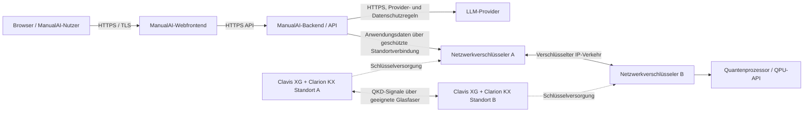

# QKD-Integration für ManualAI

**Status:** Architekturvorschlag zur Prüfung, keine implementierte oder produktiv freigegebene Integration.  
**Stand:** 8. Oktober 2026.

## Zweck und Ist-Stand

Dieses Verzeichnis beschreibt, wo eine QKD-Verbindung (Quantum Key Distribution) ManualAI sinnvoll ergänzen könnte. QKD wäre ein optionaler Schutz für **Datenverkehr zwischen zwei kontrollierten Standorten**, zum Beispiel zwischen einem ManualAI-Backend und einem separat betriebenen Quantenprozessor. Es ist keine Softwarebibliothek für die Webanwendung und kein direkter Schutz für einzelne Serverprozesse.

Im Repository sind ein statisches ManualAI-Webfrontend, API-Handler und ein Express-Server-Einstiegspunkt (`server.js`) vorhanden. Der GitHub-Actions-Workflow `.github/workflows/deploy.yml` veröffentlicht statische Dateien auf GitHub Pages; er betreibt keinen privaten Server und dokumentiert keine dedizierte Glasfaserverbindung zu einem Quantenprozessor. `api/chat.js` verwendet den Anthropic-SDK. Die tatsächliche Produktionsumgebung des Backends und des Schweizer Quantenprozessors ist im Repository nicht festgelegt.

**Folgerung:** Die nachfolgende Topologie ist ein Zielbild. Sie behauptet weder, dass ManualAI heute auf dem Schweizer Quantencomputer-Server läuft, noch, dass dort IDQ-Geräte installiert oder verfügbar sind. Vor einer Umsetzung müssen Betreiber, Standorte, Datenflüsse und Netzverbindungen bestätigt werden.

## Zielarchitektur

QKD erzeugt geteiltes Schlüsselmaterial zwischen zwei Netzstandorten. Ein kompatibler Netzwerkverschlüsseler verwendet diese Schlüssel, um den Datenverkehr auf der Verbindung zu schützen. Clavis-XG-Systeme integrieren nach Angaben von ID Quantique (IDQ) Clarion KX als QKD-Schlüsselmanagement und können an geeignete Ethernet-/OTN-Verschlüsseler angebunden werden. ETSI GS QKD 014 beschreibt zusätzlich eine REST/HTTPS-Schnittstelle zur Schlüsselübergabe an sichere Anwendungen; ob eine konkrete IDQ-Konfiguration diese Schnittstelle für ManualAI unterstützt, ist mit IDQ zu klären. [1] [2] [3]

Die Verbindungen Browser→Webfrontend, Browser→API und Backend→LLM-Provider sind **nicht** durch diese QKD-Strecke geschützt. Dafür bleiben HTTPS/TLS, sichere Authentifizierung, geeignete Kryptografie und die Prüfung der jeweiligen Hosting- und Datenverarbeitungsbedingungen notwendig.

## Einordnung der Datenflüsse

### ManualAI-Backend zu einer eigenen oder vertraglich betriebenen QPU

Hier kann QKD geprüft werden, falls beide Endpunkte in kontrollierten Rechenzentren stehen und eine geeignete Glasfaserverbindung samt kompatiblen Netzwerkverschlüsselern verfügbar ist. Die QKD-Appliances stehen an den Netzenden; der normale IP-Verkehr läuft durch die Verschlüsseler. Schlüssel sollten nicht in Browsercode, GitHub, Logs oder gewöhnlichen Umgebungsvariablen gespeichert werden.

IDQ nennt für Modelle des Clavis-XG-Portfolios je nach Ausführung Glasfaserreichweiten von etwa 60 bis 150 km. Das sind Herstellerangaben, keine Reichweitengarantie für eine beliebige Faser. Verlustbudget, Steckverbindungen, Wellenlängen, Schlüsselrate, Topologie und Verfügbarkeit müssen für den konkreten Pfad geprüft werden. Für Metro-Netze hat IDQ 2026 Clavis XG Multiplex für die Koexistenz von QKD- und klassischem Verkehr auf bestehender Faser angekündigt; das ersetzt keinen technischen Eignungstest. [1] [4]

### Backend zu einem externen LLM-Dienst

Der aktuelle Chat-Handler nutzt das Anthropic-SDK. Falls ManualAI Nutzereingaben an diesen externen Dienst sendet, endet eine lokale QKD-gesicherte Strecke nicht automatisch am Anbieter. Die Verbindung benötigt weiterhin TLS; außerdem sind Datenminimierung, Vertrag, Aufbewahrung und Anbieterzugriff zu prüfen. QKD für eine separate Backend–QPU-Verbindung verändert diesen Datenfluss nicht. [5]

### Browser zu ManualAI

Endnutzer greifen über öffentliche Netze zu. QKD ist hierfür in der Regel nicht das passende Mittel: Es braucht spezielle optische Endpunkte und eine geeignete physische Verbindung. Verwende weiterhin HTTPS/TLS und sichere Authentifizierung; plane zusätzlich die PQC-Migration für unterstützte Protokolle.

## Sicherheitsanforderungen

1. **Gegenstellen authentifizieren:** QKD ersetzt keine Authentifizierung. Der klassische QKD-Kanal und die Managementverbindungen brauchen eine abgesicherte Identitätsprüfung. Bootstrap mit einem vorab geteilten Schlüssel oder einem geeigneten PQC-/Hybridverfahren mit geprüfter Implementierung festlegen.
2. **Verschlüsselung bleibt erforderlich:** QKD liefert Schlüsselmaterial; die Nutzdaten werden von kompatiblen Netzwerkverschlüsselern oder einer explizit unterstützten sicheren Anwendung verschlüsselt. QKD allein schützt weder gespeicherte Daten noch Endpunkte.
3. **Schlüsselmanagement isolieren:** Clarion KX/QKMS und die Verschlüsseler in geschützten Management- und Sicherheitszonen betreiben. Keine Schlüsselwerte in App-Logs, Telemetrie, Supporttickets, Quellcode oder Browsern.
4. **Ausfallverhalten festlegen:** QKD-Link- oder Schlüsselraten-Ausfall kann die Verfügbarkeit betreffen. Entscheiden, ob Verkehr blockiert oder über einen ausdrücklich genehmigten PQC-/Hybridweg weitergeführt wird. Kein stiller Rückfall auf veralteten RSA-/ECDH-Schlüsselaustausch.
5. **Zwischenknoten und physische Umgebung bewerten:** Reichweitenverlängerung über vertrauenswürdige Relays erfordert, die Zwischenstandorte und deren Betreiber in die Sicherheitsgrenze aufzunehmen.
6. **Verfügbarkeit und Updates absichern:** Redundante Stromversorgung, Glasfaserpfade, Gerätemonitoring, sichere Firmwareupdates, Rollen-/Zugriffssteuerung, Audit-Logs und Incident-Prozess definieren.
7. **Schichten außerhalb QKD schützen:** API-Zugänge, Admin-Konten, Secrets, Datenbanken, Backups, Container/VMs, Betriebssysteme und QPU-APIs bleiben separat abzusichern.

## Abgrenzung und Entscheidung

QKD ist nur dann eine sinnvolle Ergänzung, wenn ein konkreter, langfristig sensibler **Standort-zu-Standort-Datenfluss** vorliegt und Betreiber sowie Faserzugang die benötigte Hardwareintegration ermöglichen. Für ManualAI sollte zuerst geklärt werden, ob die QPU-Verbindung privat oder öffentlich ist, welche Daten tatsächlich übertragen werden und wo API- und Rechenendpunkte betrieben werden.

PQC und QKD lösen unterschiedliche Teile des Problems. PQC läuft auf klassischer Infrastruktur und ist für breitere Protokoll- und Softwaremigration geeignet. QKD kann in geeigneten Netzen zusätzliche Schlüsselverteilung ermöglichen, braucht aber spezielle Geräte, physische Infrastruktur und sicheres Schlüsselmanagement. Für die QKD-Authentifizierung, digitale Signaturen, Nutzeranmeldung und andere nicht von QKD abgedeckte Funktionen ist weiterhin klassische beziehungsweise post-quantenfeste Kryptografie nötig. NIST empfiehlt Organisationen, die Migration auf seine finalisierten PQC-Standards zu beginnen. [6] [7]

## Referenzen

[1]: https://www.idquantique.com/quantum-safe-security/products/clavis-xg-qkd-portfolio/ "ID Quantique — Clavis XG QKD Portfolio"
[2]: https://www.idquantique.com/quantum-safe-security/products/clarion-kx-platform/ "ID Quantique — Clarion KX Platform"
[3]: https://www.etsi.org/deliver/etsi_gs/QKD/001_099/014/01.01.01_60/gs_qkd014v010101p.pdf "ETSI GS QKD 014 — Key delivery API specification"
[4]: https://www.idquantique.com/clavis-xg-multiplex-announcement/ "ID Quantique — Clavis XG Multiplex announcement"
[5]: https://github.com/makopipokam/manualai.org/blob/main/api/chat.js "ManualAI — Chat API implementation"
[6]: https://www.nsa.gov/Cybersecurity/Quantum-Key-Distribution-QKD-and-Quantum-Cryptography-QC/ "NSA — QKD and Quantum Cryptography limitations"
[7]: https://www.nist.gov/pqc "NIST — Post-Quantum Cryptography"
